# 前端图标、交互逻辑与状态一致性交接

日期：2026-10-08。任务：打开本地项目，实测图标的一致性、尺寸、对齐与裁切，并补充检查前端交互、状态同步与异常反馈，定位源码并交接后续修改。本次完成浏览器检查与文档取证，未实施界面改版。图标部分见第1–9节，交互补充见第10–14节。

## 1. 接手时先读

交互补充后，建议优先修复**工作区标识与文件列表身份错位、顶部新建会话失败但静默切换、刷新恢复旧目录、切模块丢草稿**，详见第11节。图标方面优先修复两处影响操作的裁切：**1024px 窗口下文件栏上传按钮不可见；1440px 三栏布局下模型选择弹层左侧被裁掉**。OpenCode 图标的白色方块也有明确的 SVG 配置原因。其余观感问题主要来自多套按钮规格、功能 SVG 与字符/emoji 混用，以及过小的复杂图标。

普通功能图标已经集中在 `Icon` 中，统一使用 24×24 viewBox 和默认 strokeWidth=2。没有发现调用方普遍任意设置线宽的证据。建议沿用现有组件做局部收束，并用单一图标来源补齐缺项。

优先顺序：操作可达性 → 错误或缺失图标 → 同一语义的一致性 → 尺寸、留白和颜色细节。接手者应先复现下面的问题，再修改对应规则。

## 2. 环境与证据范围

| 项目 | 本次记录 |
| --- | --- |
| 项目目录 | `F:\Claude code本地文件\office-agent-web` |
| 页面 | `http://127.0.0.1:3002/`，标题 Open Plan 规聚 |
| 取证时间 | 2026-10-08 下午，Asia/Shanghai |
| 浏览器 | Playwright 打开的可见 Chromium，Windows；UA 中 Chrome/147.0.0.0 |
| 视口 | 1440×900、1024×768、390×844，CSS 像素；DPR 约 1 |
| 主题 | 默认暗色、亮色各检查一次；最终恢复暗色 |
| 布局 | 项目侧栏、文件侧栏、能力侧栏；右侧预览关闭/展开；模型与命令弹层 |
| 仓库 HEAD | `461738ad`；工作区有原有未提交修改 |
| package.json | 版本 0.11.33 |
| 运行服务 | `/api/status` 返回 0.11.30，PID 43360，SDK 1.0.4 |
| 浏览器加载的样式 | `/assets/index-CJciTi4p.css`、`/assets/DocViewer-g3oyHOct.css` |

运行服务版本与仓库声明版本不同。接手时记录重新构建/重启后的服务版本和资源文件名；不能仅凭版本差异就断言所有前端文件都过期。本次结论针对实际加载的页面，源码位置用于定位，修改前应再次核对。

桌面浏览器控制工具曾因沙箱启动错误不可用，随后使用本机已有 Playwright CLI 完成可见浏览器取证。没有安装新浏览器依赖，没有调用模型生成测试产物。截图都是本次现场捕获并查看过的文件。

## 3. 检查步骤与总体情况

| 步骤 | 操作与页面 | 结果 | 证据 |
| --- | --- | --- | --- |
| 1 | 1440×900 暗色首页，项目侧栏 | 功能图标基本正常；顶部与输入区按钮大小离散 | 01-首页宽屏.png、宽屏工具按钮测量.json |
| 2 | 切到文件侧栏，保持宽屏 | 按钮可见，但文件夹、文件徽章与三角字符混用 | 02-文件侧栏.png |
| 3 | 展开右侧预览，缩到 1024×768 | 上传按钮被侧栏裁切；顶部会话标题图标所在容器被压到零宽 | 03-预览窄桌面.png、窄桌面测量.json |
| 4 | 返回 1440×900，进入设置与外观分类 | 可正常切换；图标按钮与卡片图标规格不同 | 04-设置宽屏.png |
| 5 | 返回对话，打开模型选择器，保持三栏 | 弹层左侧被裁切；OpenCode 品牌图形为白色方块 | 05-模型图标.png、弹层祖先裁切测量.json、模型弹层测量.json |
| 6 | 打开命令面板 | 可正常打开/退出；文件入口用了 emoji，与侧栏 SVG 不一致 | 06-命令面板.png |
| 7 | 亮色，390×844，侧栏与预览均展开 | 主区与右侧操作超出视口；预览整栏在可见范围外 | 07-窄屏亮色.png、极窄屏布局测量.json |
| 8 | 1440×900 亮色能力侧栏 | 能力入口基本统一，是后续收束可参考的现有模式 | 08-能力亮色.png |
| 9 | 手动打开列表中的小型 Markdown 文档 | 被“文件不存在或已被移动”提示阻断；未取得实际文档标签截图 | 下文复测限制 |

## 4. 问题清单与修复交接

### 问题 1：文件栏上传图标被裁切（P1，浏览器已复现）

**复现**：文件侧栏 → 展开右侧预览 → 视口 1024×768。侧栏实际宽度 210px，文件工具栏没有足够的收缩或换行空间。

**测量**：上传按钮 x=208.31、宽=24.60，右边缘=232.91；上传 SVG x=215.11、宽=11，右边缘=226.11。祖先 `.sidebar` 的右边缘是 210，且隐藏溢出。SVG 整体在裁切边界外，按钮只剩边缘，属于容器布局问题。

**源码**：[文件栏按钮](<F:/Claude code本地文件/office-agent-web/client/src/components/SessionSidebar.jsx:879>)；[工具栏布局](<F:/Claude code本地文件/office-agent-web/client/src/styles.css:5692>)；`.section-sort` 与 `.section-refresh/.section-upload` 固定占位见 styles.css:5717；侧栏 210px 断点见 styles.css:9694。

**建议**：保留常用操作，把排序说明/计数安排为可收缩内容；空间不足时将次要动作放入“更多”，或让动作组占独立一行。为最窄侧栏制定实际宽度预算。不要仅对侧栏改成 overflow:visible，也不要继续缩小图标。

**验收**：侧栏分别为 180/210/274px 时，刷新、新建、选择本机文件、上传都可见或能从“更多”访问；键盘焦点与点击区域不被裁切。

### 问题 2：模型弹层左侧被裁切（P1，浏览器已复现）

**复现**：1440×900 → 侧栏与预览同时展开 → 点击输入区“DeepSeek V4 Flash 快速”。

**测量**：`.model-control-pop` 宽 320px，左边缘 x=241.60；`.center-chat-slot` 左边缘 x=279，overflow:hidden。约 37.4px 的弹层左侧被裁切，品牌图标、标题和列表文字都受影响。弹层用 right:0 对齐窄触发器，向左伸出；提高 z-index 无法越过祖先裁切。

**源码**：[弹层基础样式](<F:/Claude code本地文件/office-agent-web/client/src/styles.css:5986>)；[模型弹层定位](<F:/Claude code本地文件/office-agent-web/client/src/styles.css:6034>)；[裁切祖先](<F:/Claude code本地文件/office-agent-web/client/src/styles.css:5432>)。基础 `.ct-pop` 还有 max-width:320px，最终计算宽度并不是后置声明的 360px。

**建议**：为模型选择器做有边界约束的弹层定位，优先使用 Portal 到顶层；按触发器位置与可用屏幕空间限制 left/top/width。若采用局部定位，必须验证全部祖先裁切关系与地图模式。菜单内容自身继续滚动。

**验收**：宽屏、1024px、侧栏拖窄、预览关闭/展开以及地图模式中，弹层所有边缘处于可视范围内；图标/首列文字完整，焦点与退出行为正常。

### 问题 3：OpenCode 品牌图标退化为白色方块（P2，浏览器与源码共同确认）

**现象**：输入区模型入口显示蓝底白块；模型弹层中的品牌图形也无法辨识。

**原因**：[OpenCode 路径](<F:/Claude code本地文件/office-agent-web/client/src/components/Icon.jsx:132>) 中第一条是闭合方形路径，第二条是交叉线；[ProviderIcon](<F:/Claude code本地文件/office-agent-web/client/src/components/Icon.jsx:136>) 全局使用 fill=currentColor、stroke=none。闭合方形被填满，交叉线没有描边，最终只剩实心方块。本次 DOM 测量也确认 fill 为品牌白色、stroke 为 none。

这不是“DeepSeek Logo 没加载”：当前实际 provider 是 `opencode-go`，模型是 `deepseek-v4-flash`，显示供应商标记本身合理。

**建议**：采用项目已有的准确品牌资源，或给需要描边的品牌图形单独保留正确 fill/stroke。品牌图标可以保留品牌形状，统一容器、光学尺寸与留白。

**验收**：14/18px 下轮廓可辨；暗色、亮色均正常；输入入口与弹层一致；实际供应商和品牌对应。

### 问题 4：窄屏三栏布局没有真正让位（P2；若承诺窄屏可用，升为 P1；已复现）

**复现**：390×844、侧栏展开、预览展开。截图中的主区只显示一部分，发送与顶部操作在屏幕右侧之外。

**测量**：侧栏宽=210；主区从 x=215 开始，最小宽=300，右边缘=515；预览从 x=520 开始、宽约390、右边缘约910；`.app` 宽约390 且 overflow:hidden。设置预览为 100vw 并没有把它移到视口内。

**源码**：[1024px 断点](<F:/Claude code本地文件/office-agent-web/client/src/styles.css:9694>) 保留主区 min-width:300px；[768px 断点](<F:/Claude code本地文件/office-agent-web/client/src/styles.css:9701>) 仅修改右侧栏宽度。布局类在 [App.jsx](<F:/Claude code本地文件/office-agent-web/client/src/App.jsx:1267>)。

**建议**：明确产品支持的最小窗口。若支持极窄窗口，侧栏用可关闭抽屉，预览作为独立覆盖面板，只保留一个主操作面；顶部工具做优先级折叠。若只支持桌面，也要把最小宽度写进验收基线并覆盖 1024px。

**验收**：支持的窗口宽度下，发送、模式切换、预览退出始终可达；不会出现隐藏溢出掩盖操作区。

### 问题 5：同排按钮高度与图标规格不一致（P2，已测量）

1440px 首页顶部：新建对话 30×30、预览 30×30、任务中心 30×30，内置浏览器入口却约34.6×24。侧栏“新建会话”约26.6×20，输入区新建为28×27。相同加号出现在不同大小/留白的按钮里，部分描边按钮与无描边按钮又相邻使用。

**源码**：[顶部按钮](<F:/Claude code本地文件/office-agent-web/client/src/App.jsx:1474>)；[新建/预览局部规则](<F:/Claude code本地文件/office-agent-web/client/src/styles.css:8307>)；[输入工具按钮](<F:/Claude code本地文件/office-agent-web/client/src/styles.css:8397>)；通用规格另有 [icon-btn](<F:/Claude code本地文件/office-agent-web/client/src/styles.css:4224>)、[btn-icon](<F:/Claude code本地文件/office-agent-web/client/src/styles.css:6330>)。

**建议**：同一工具栏统一按钮容器、边框、圆角、双轴居中和交互状态；保留紧凑列表与主工具栏两个密度层级。建议主操作图标16px、容器32px，辅助图标14px、容器28px作为起点，再按真实布局验收；这是建议值，尚未实施。

**验收**：同排按钮垂直居中、点击区域一致；hover/focus/active/disabled 有统一表达；不得因统一放大导致问题1复发。

### 问题 6：功能图标混用 SVG、字形与 emoji（P2，浏览器和源码确认）

首页侧栏收起是实心“◀”，文件夹右侧是“▶”；命令面板文件入口是 emoji 文档，侧栏文件夹则是线性 SVG。文件类型还用彩色字母徽章。各来源的轮廓、基线与光学大小不同，emoji 的外观也受系统字体影响。

**源码**：[侧栏开关字符](<F:/Claude code本地文件/office-agent-web/client/src/App.jsx:1418>)；[文件夹字符](<F:/Claude code本地文件/office-agent-web/client/src/components/SessionSidebar.jsx:928>)；[命令面板 emoji 映射](<F:/Claude code本地文件/office-agent-web/client/src/components/CommandPalette.jsx:13>)；[文件类型标记](<F:/Claude code本地文件/office-agent-web/client/src/components/SessionSidebar.jsx:29>) 与 [徽章样式](<F:/Claude code本地文件/office-agent-web/client/src/styles.css:469>)。

关闭语义也有 SVG、×、✕ 多套实现，例如 DocViewer.jsx:863、DocxViewer.jsx:755、SessionSidebar.jsx:705/733、KnowledgeBase.jsx:520/650。这些是源码确认，实际文档标签的关闭按钮本次未完成实测。

**建议**：普通功能入口统一走现有 Icon；收起/展开采用统一 chevron，关闭采用 close。保留品牌 Logo、确有意义的状态圆点。文件类型表达选一种规则，并让文件列表、预览标签、产物列表、命令面板使用同一映射；避免同一文件在不同入口长相不同。

**验收**：同一语义只出现一种功能图形；图形有一致颜色层级，不把所有静态功能图标都涂成强调色。图标本身 aria-hidden 时，按钮有清晰可访问名称；测试键盘焦点，不仅检查 title 提示。

### 问题 7：三个注册缺项导致图标静默消失（P2，源码确认，尚未进入对应流程实测）

| 调用位置 | 使用名称 | 问题与建议 |
| --- | --- | --- |
| [DocxViewer.jsx:604](<F:/Claude code本地文件/office-agent-web/client/src/components/DocxViewer.jsx:604>) | `pen-tool` | 当前库使用 `penTool`，统一调用名 |
| [MemoryTab.jsx:195](<F:/Claude code本地文件/office-agent-web/client/src/components/MemoryTab.jsx:195>) | `bookmark` | 库中无此项；补注册或选已有且语义准确的图标 |
| [M3BusPanel.jsx:74](<F:/Claude code本地文件/office-agent-web/client/src/components/M3BusPanel.jsx:74>) | `bus` | 库中无此项；补注册或明确回退图标 |

[Icon.jsx:98](<F:/Claude code本地文件/office-agent-web/client/src/components/Icon.jsx:98>) 对未知名称直接 return null，页面不会显示占位。缺失图标应先查名称注册，不能直接判断为溢出。

**建议与验收**：修正以上三处并进入对应页面确认；开发期对未知名称给出可定位警告。后续新增图标从现有一致来源补齐，不新增第二套任意图形风格。

### 问题 8：小图标与后置样式覆盖增加视觉差异（P2，尺寸实测与源码确认）

首页可见功能图标从11到16px不等；侧栏源码还有10px。2/24 的描边比例随尺寸缩放，11px 图标的可见线宽约0.92 CSS px，复杂图形会显得细碎。全局 `.icon` 的 vertical-align:-2px 也会影响文字行内基线，不能用于解释所有 flex 布局中的对齐差异。

**源码**：[Icon 默认参数](<F:/Claude code本地文件/office-agent-web/client/src/components/Icon.jsx:97>)；[全局对齐](<F:/Claude code本地文件/office-agent-web/client/src/styles.css:2603>)；SessionSidebar.jsx:242/259/285 可见12/11/10px调用。文件行、工具栏样式在 styles.css 中有多次后置覆盖，修改时应查看最终 computed style。

**建议**：把14/16px作为普通辅助/操作图标的常用档位，10–12px限于简单指示符。复杂的编辑、设置、工具类图形优先保证可辨识；对行内图标和按钮图标分别设置对齐。只收束本次涉及的规则，避免全面重写一万行样式文件。

**验收**：100% 与125%页面缩放下，复杂图标可辨且居中；不依赖字体字形“碰巧”对齐。品牌图形保持自己的光学尺寸，不强制等同线性图标的描边。

## 5. 建议实施步骤

1. 记录当前构建资源与运行版本，在当前工作区保留原有变更；复现问题1、2并截图。
2. 修文件栏空间分配、模型弹层定位，先验操作可达性。
3. 修 OpenCode fill/stroke 与三个未知图标名称，分别进入对应流程验收。
4. 收束本次涉及的按钮规格与功能图标来源，统一同一文件类型在各入口的表达。
5. 明确最低支持窗口，再修窄屏侧栏/预览的让位行为。
6. 重新构建前端并确认实际加载的新资源；重复下面矩阵，补充修复后截图。

## 6. 交接验收矩阵

以下是接手者要执行的检查，不代表本次全部完成。

| 维度 | 验收范围 |
| --- | --- |
| 窗口 | 1440、1366、1280、1024px；若支持窄屏再加768、390px |
| 侧栏宽度 | 180/210/274px；手动拖动后的边界 |
| 面板组合 | 预览关/开、地图模式、浏览器面板开；模型菜单分别展开 |
| 主题与缩放 | 默认暗色/亮色，100%/125% |
| 控件状态 | hover、键盘focus、active、disabled |
| 图标来源 | 功能SVG、品牌标记、文件类型标记、未知名称 |
| 可达性 | 上传、新建、模型切换、发送、预览关闭；Tab/Enter/Escape |
| 文档场景 | 有效的小型 Markdown、HTML、Word 文件；检查标签及编辑/关闭图标 |

可沿用仓库 `npm.cmd run test:a11y` 中适合本次的窄屏检查，并追加能捕获**祖先裁切**的浏览器断言。仅检查 document.scrollWidth 不够：本次390px页面没有文档横向滚动，操作区仍被 overflow:hidden 隐藏。仅比较 SVG 与按钮边框也不够，上传 SVG 在按钮内部却整体超出侧栏。

## 7. 复测限制与独立问题

- 本次没有遍历所有地图模块、运行中的工具卡、Word 编辑器与产物类型，不能声称全站图标都检查完毕。
- 打开列表中的 `审查报告_公交体检系统产品说明书1.md` 后出现“文件不存在或已被移动”提示，并刷新文件列表。该步没有有效文档预览截图；没有冒充已验收。后续选择确认存在的小文件复测。文件列表/打开文件状态不一致可另立问题，不应混进图标修复。
- 没有执行模型任务、上传新业务文件、删除文件或修改凭据。图标缺失三项为源码确认，需接手者完成页面实测。
- 没有做完整无障碍合规审查。本次关于可访问名称和点击区域的建议需要键盘与辅助技术验证。
- 测试结束已恢复1440×900、暗色、项目侧栏、预览关闭，本地测试浏览器保持打开。

## 8. 截图证据

### 01：首页宽屏

状态基本正常，可比较顶部与输入区图标按钮的尺寸、颜色和留白。

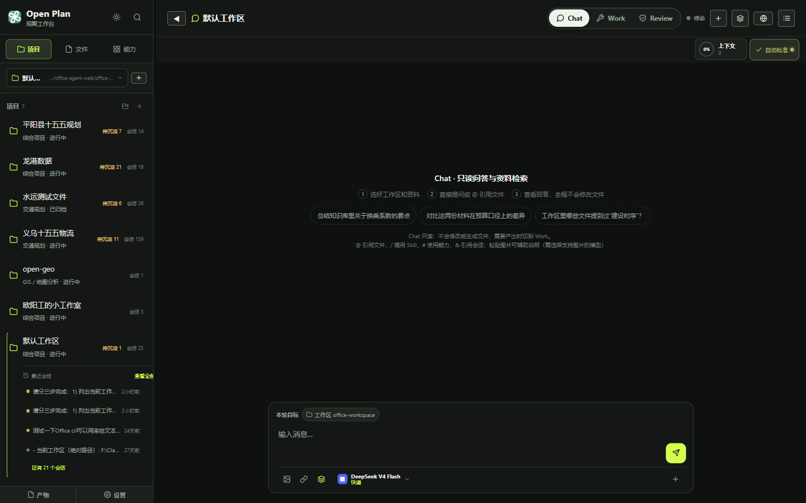

### 02：文件侧栏

可见文件夹线性图标、三角字符以及一排紧凑动作按钮。

### 03：预览展开，1024px窄桌面

上传按钮被侧栏隐藏，会话标题图标所在区域也被挤压。

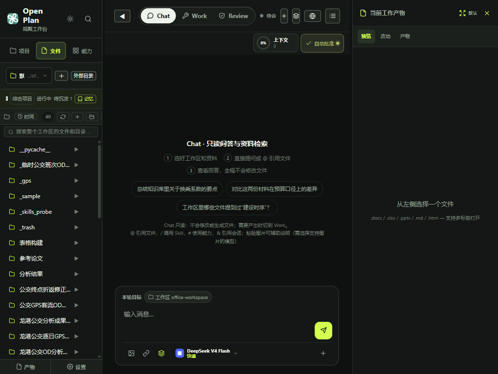

### 04：设置宽屏

设置可打开，卡片图标与工具按钮采用不同规格；未进行模型真实连接测试。

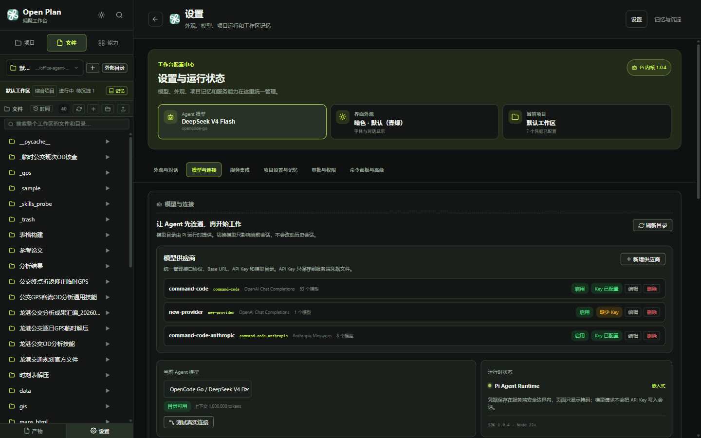

### 05：模型选择器

弹层左侧裁切；底部模型入口中的OpenCode图形为白块。

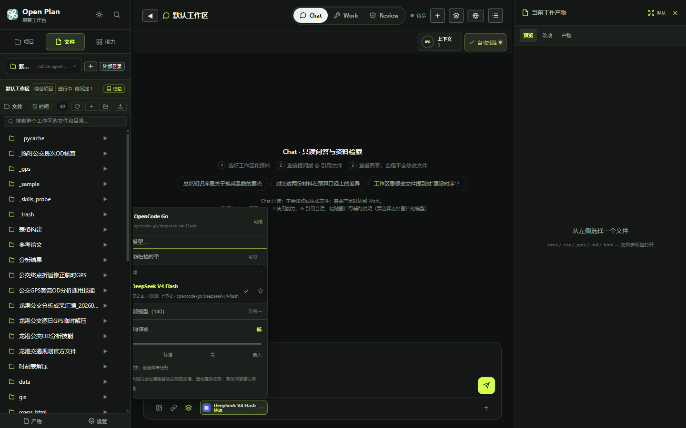

### 06：命令面板

入口可用，文档图形来自emoji，与主侧栏不一致。

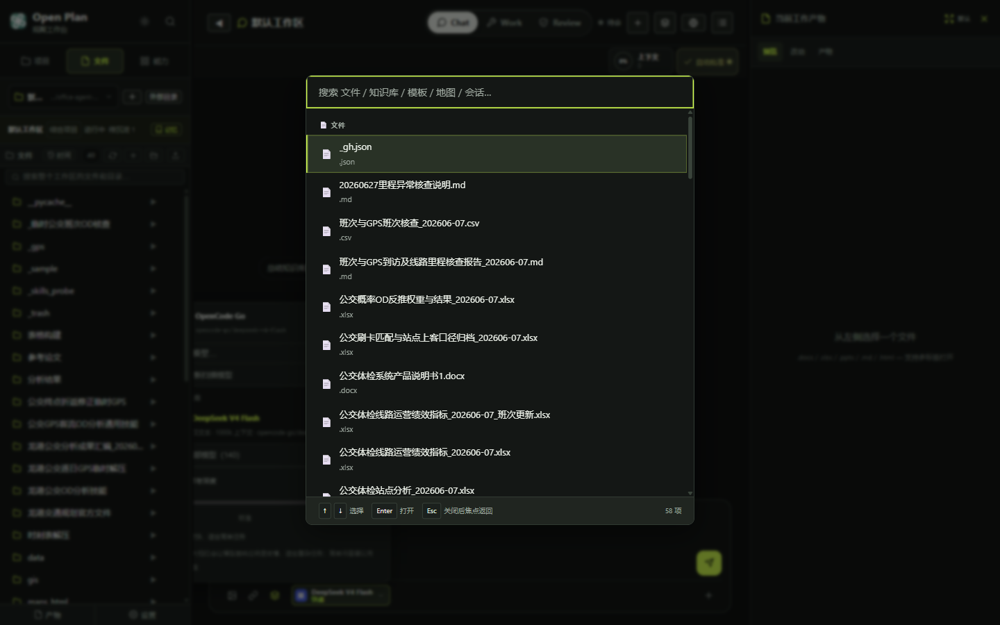

### 07：390px亮色窄屏

主区与预览没有进入有效的单栏或覆盖布局，右侧操作超出视口。

### 08：亮色能力侧栏

此处能力入口线性图标基本统一，可作为现有设计语言的参考。

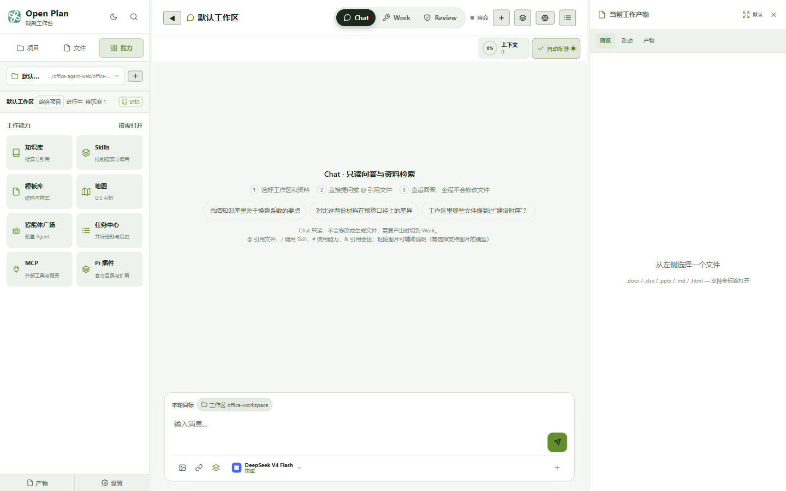

## 9. 原始测量

- [窄桌面测量](图标审查截图/窄桌面测量.json)：上传按钮与标题图标的祖先裁切。
- [弹层祖先裁切测量](图标审查截图/弹层祖先裁切测量.json)：模型弹层位置、祖先边界与overflow。
- [模型弹层测量](图标审查截图/模型弹层测量.json)：OpenCode SVG实际fill/stroke与路径。
- [极窄屏布局测量](图标审查截图/极窄屏布局测量.json)：390px视口下各栏实际宽度与位置。
- [宽屏工具按钮测量](图标审查截图/宽屏工具按钮测量.json)：顶部与输入区按钮/图标的实际尺寸。

## 10. 前端交互逻辑梳理

本节于同日下午追加。沿用可见的本地测试浏览器，实测模式、草稿、新建、目录、弹层、任务筛选与产物失败反馈；同时只读检查项目/工作区/历史会话的异步状态逻辑。新加载的主资源为 `/assets/index-BOmS6ZhM.js`，运行服务仍为0.11.30。不要把前一轮“已实现刷新新开始”的结论当成当前版本的验收结果：当前代码与实测都发现了回归。

### 10.1 用户操作与状态责任

| 用户操作 | 现有主链路 | 本次确认的情况 |
| --- | --- | --- |
| 选项目 | project.rootPath → handleWorkspaceChange → switchWorkspace → 新建会话 | 项目由当前workspace派生；切换和新建是分离的异步步骤，失败与并发需要补验 |
| 浏览目录 | currentDir → listFiles → files；点击项拼成相对路径 | 目录请求已有序号；列表接口没有携带当前cwd，存在身份错位 |
| 新建会话 | createAgentThread → thread/session → 清历史、标签、目录 | 顶部参数误传；侧栏能创建空会话，但目录与文件列表不同步 |
| 打开历史 | 切工作区 → 并行加载历史/恢复runtime → 更新thread → 尝试打开关联文件 | 有历史点击序号；跨工作区关联文件漏传cwd，需复测 |
| 打开文件 | cwd+relativePath → 中止上次打开 → fetch → 校验身份 → 激活预览标签 | 主预览请求已有中止与序号防护；调用方和列表身份仍可能错 |
| Chat/Work/Review | 顶部调用ChatPanel.setMode → editMode → 提示与runState.mode | 本次模式提示同步，模式间草稿保留；未验证实际模型执行权限 |
| 打开设置/能力/成果模块 | activeModule互斥 → 主ChatPanel卸载 → 返回时重新挂载 | 模块导航能返回，但主对话草稿丢失 |
| 查看任务 | 打开任务浮层 → 项目/状态/模式筛选 → 详情/历史入口 | completed筛选与Escape退出正常；未执行取消、重试或恢复任务 |
| 查看产物 | 按会话与run范围取runs/published/acceptance → 预览/人工确认/固定 | 模拟读取失败后被显示成“暂未生成产物”；固定/回滚未执行 |
| 刷新 | workspace恢复 → currentDir恢复 → 查lastSessionId → 尝试恢复历史 | 子目录恢复已实测；非空旧历史恢复为源码确认，未实测 |

状态一致性应沿下面关系检查。每个展示文件、引用、预览与产物都需要能追溯到同一个目录身份。

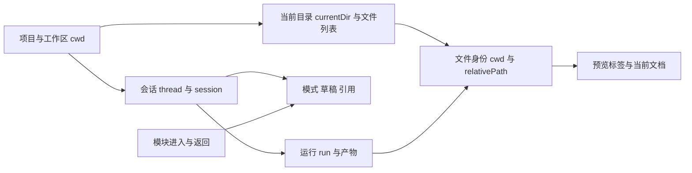

### 10.2 应落实的交互约定

1. 项目名、工作区路径、文件树来源、引用和预览的cwd保持一致；请求身份不一致时，先阻止展示为当前目录的数据。
2. 新建成功后才提交新的session/thread与清空旧上下文；失败保留有效状态并显示可重试提示。
3. 按用户已批准规则：刷新或重启保留工作区，进入根目录和空白新会话，旧会话与产物手动打开。
4. 进入设置或只读能力模块不丢主对话未发送草稿；草稿按thread隔离，切换模式保留草稿。
5. 弹层统一支持Escape、外部点击退出、焦点返回触发器；多个弹层按层级处理退出。
6. 请求失败、加载中、确实为空、保留旧数据是不同状态；用户应能区分并重试。
7. 连续导航只提交最后一次操作的结果；新建、换工作区、选历史共享导航失效边界。

## 11. 交互问题与修复交接

### 交互1：页面工作区与文件列表来自不同目录（P1，实测确认）

**实际证据**：页面工作区开关与输入区目标显示 `F:\Claude code本地文件\office-agent-web\office-workspace`，但同页读取 `/api/files` 返回 `workspace=F:\龙港数据`、40项。截图中的`_gps`、`_sample`等列表来自后者。原始数据见[工作区身份错位测量](交互审查截图/工作区身份错位测量.json)。

这解释了上一轮手动点击列表里的Markdown文件后404：打开接口明确携带页面显示的默认工作区cwd，而列表文件实际属于龙港数据。**没有实测执行跨目录写入**；当前已确认的是列表/打开身份错位，其他文件动作也需审查作用域。

**源码**：[api.js:27](<F:/Claude code本地文件/office-agent-web/client/src/api.js:27>) 的listFiles只传dir；[App.jsx:385](<F:/Claude code本地文件/office-agent-web/client/src/App.jsx:385>) 接收结果时没有核对result.workspace与currentWorkspace；[server/index.mjs:774](<F:/Claude code本地文件/office-agent-web/server/index.mjs:774>) 使用服务端getWorkspace；[App.jsx:540](<F:/Claude code本地文件/office-agent-web/client/src/App.jsx:540>) 恢复页面工作区来自保存值或列表首项。文件搜索同样要核对cwd，不能只修列表显示。

**建议**：列表、搜索与文件动作显式传workspace身份，服务端按该身份解析；前端核对返回身份。启动时等工作区确定再读取文件，切换过程中用generation丢弃旧响应。避免依赖一个全局可变getWorkspace来承载多个浏览器页的请求。

**验收**：A/B两项目各放一个同名小文件；分别在两页浏览、搜索、打开、@引用，项目标签、返回workspace与文件内容始终匹配。切换另一页工作区后，当前页不得悄悄换文件来源。

### 交互2：顶部新建对话报错，界面仍切换（P1，实测确认）

**复现**：输入测试草稿 → 点顶部加号“新建对话”。控制台出现 `创建新会话失败，将在首次对话时自动创建: Converting circular structure to JSON`。随后thread改变、输入被清空，页面没有错误提示。侧栏新建没有该参数问题，本次确实创建了一个空白测试会话。

**原因**：[App.jsx:1474](<F:/Claude code本地文件/office-agent-web/client/src/App.jsx:1474>) 直接onClick={handleNewSession}；[函数:342](<F:/Claude code本地文件/office-agent-web/client/src/App.jsx:342>) 将首参数作为workspace；[api.js:94](<F:/Claude code本地文件/office-agent-web/client/src/api.js:94>) 序列化cwd时遇到React点击事件的环形引用。App:352–370捕获失败后仍切换thread、清上下文。

**建议**：所有UI入口统一零参数包装，函数入口校验workspace字符串；新建增加pending与可见失败状态。失败时不把未创建的新thread当成功结果，不清空旧会话/草稿。

**验收**：顶部、侧栏、输入工具区三入口都创建正确cwd的会话；模拟503或序列化失败，旧会话与草稿保留，用户可重试；连续点击不产生不可解释的顺序覆盖。

证据：[顶部新建失败日志](交互审查截图/顶部新建失败日志.txt)，交互截图02。

### 交互3：进入设置再返回，未发送草稿丢失（P1，实测确认）

**复现**：填入“交互审查草稿：打开设置后应保留，不发送。” → 打开设置 → 返回对话。thread未改变，textarea.value却变为空字符串。模式切换测试中草稿正常保留，因此丢失发生在模块导航生命周期。

**源码**：[App.jsx:1498](<F:/Claude code本地文件/office-agent-web/client/src/App.jsx:1498>) 的activeModule使主ChatPanel卸载；草稿存于ChatPanel局部state，重挂载时初始化；[ChatPanel.jsx:918](<F:/Claude code本地文件/office-agent-web/client/src/components/ChatPanel.jsx:918>) 还会在历史/thread水合时清空input。

**建议**：按thread把draft/references/附件状态保存在稳定的上层或小型draft缓存；模块导航只改变视图。新建/用户明确清空时才删除对应草稿，切换会话不能把A的草稿带到B。

**验收**：设置、知识库、Skills、产物模块进入/返回保留同一thread草稿；A/B会话分别有不同草稿，切换不丢失也不串用；明确新建会话行为另行验收。只验证了设置路径，其他模块需接手者补测。

### 交互4：刷新恢复旧子目录，违背已批准规则（P1；目录已实测，历史为源码确认）

**复现**：文件侧栏进入`_sample`，列表显示`20260606` → 刷新 → 再点文件侧栏。仍显示`/_sample`和同一列表。刷新前后localStorage中的currentDir均为`_sample`。

**源码**：[App.jsx:1177](<F:/Claude code本地文件/office-agent-web/client/src/App.jsx:1177>) 主动恢复saved.currentDir；[App.jsx:1190](<F:/Claude code本地文件/office-agent-web/client/src/App.jsx:1190>) 查saved.lastSessionId后尝试handleSelectSession；[App.jsx:953](<F:/Claude code本地文件/office-agent-web/client/src/App.jsx:953>) 历史恢复还可能自动打开关联文件。

**建议**：刷新/服务重启入口只恢复workspace与必要的视图偏好，目录置根并读根列表，建立空会话；历史会话与旧文件只走手动入口。清理旧存储字段的兼容策略，避免遗留lastSessionId/currentDir继续触发自动恢复。

**验收**：保存非根目录+有效旧历史+打开的文件后刷新，实际没有自动resume旧会话、没有打开旧文件，文件树在当前工作区根；页面不刷新而服务重启时也按同一规则回到新开始。非空历史与服务重启未在本轮操作，需补测。

证据：[刷新前](交互审查截图/刷新前目录状态.json)、[刷新后](交互审查截图/刷新后目录状态.json)，交互截图08。

### 交互5：子目录中新建后，路径归根而列表仍旧（P1，实测确认）

**复现**：`_sample`列表为`20260606` → 点侧栏“新建会话”。新sessionId已建立，保存状态currentDir变为`""`，目录面包屑消失，但文件列表仍只有`20260606`。点击它会按新的根目录解释路径。

**源码**：[App.jsx:366](<F:/Claude code本地文件/office-agent-web/client/src/App.jsx:366>) 仅重置currentDir/ref，没有同步清列表并读取根目录；[SessionSidebar.jsx:908](<F:/Claude code本地文件/office-agent-web/client/src/components/SessionSidebar.jsx:908>) 用currentDir拼文件路径。旧目录项不能继续当根目录项显示。

**建议**：目录状态与列表作为同一次导航更新；归根时使旧目录请求失效、读取明确cwd的根列表，加载中不允许对旧项执行打开/引用/删除。

**验收**：子目录中新建后根列表准确；请求慢或失败时不会显示可操作的旧子目录项；新会话的@引用路径正确。

证据：[新建后状态](交互审查截图/侧栏新建目录列表状态.json)，交互截图09。

### 交互6：产物读取失败显示为“暂无产物”（P1，浏览器模拟失败已复现）

**复现**：只在测试浏览器拦截GET产物接口，返回HTTP503 → 成果模块点刷新。控制台确认/api/artifacts返回503，页面却显示0项和“当前会话暂未生成产物”，没有错误原因或读取失败标识。刷新按钮仍存在，但用户不知道需要重试。

**源码**：[工作产物面板.jsx:125](<F:/Claude code本地文件/office-agent-web/client/src/components/工作产物面板.jsx:125>) 用Promise.all读runs与published；[catch:147](<F:/Claude code本地文件/office-agent-web/client/src/components/工作产物面板.jsx:147>) 吞错；[空状态:211](<F:/Claude code本地文件/office-agent-web/client/src/components/工作产物面板.jsx:211>) 把读取失败后的空数据渲染为空内容。有旧数据时也缺少陈旧标记。

**建议**：增加error/loading/stale/source身份；失败时说明哪项读取失败，保留旧数据则明确来源与更新时间。当前会话、当前run与正式版本可以分别处理读取错误，不让一项失败伪装成整体无成果。

**验收**：正常为空显示空状态；503/断网显示读取失败与重试；恢复后可刷新正确数据；跨会话失败时不把A的数据当B的成果。未执行固定、人工确认、回滚等业务动作。

证据：[503日志](交互审查截图/产物读取失败日志.txt)，交互截图06。测试路由已全部移除，并刷新恢复真实接口。

### 交互7：模型弹层不能用Escape或外部点击退出（P2，实测确认）

**复现**：打开模型菜单 → Escape，菜单仍在；再点击顶部Chat模式，模式已切换，但模型菜单仍在。DOM两次确认modelOpen=true。任务中心在同次检查中能用Escape正常关闭，行为不一致。

**源码**：[ChatPanel.jsx:473](<F:/Claude code本地文件/office-agent-web/client/src/components/ChatPanel.jsx:473>) modelOpen独立状态；[触发器:3252](<F:/Claude code本地文件/office-agent-web/client/src/components/ChatPanel.jsx:3252>) 切换开关；只在选择模型或再次点触发器时关闭。输入框的Escape处理只针对composerMenu。

**建议与验收**：补齐统一的dismiss行为、焦点返回与aria-expanded；点击外部/按Escape关闭模型菜单。打开Ctrl+K等上层弹层时，不保留相互抢焦点的下层菜单。不要让Escape误取消正在运行的任务。

### 交互8：跨导航异步请求缺少共同失效边界（P1风险，源码确认，尚未模拟竞态）

工作区请求有workspaceSwitchSeq，历史请求有sessionLoadSeq，文件打开有docRequestSeq与AbortController，这些局部防护值得保留。但[新建会话](<F:/Claude code本地文件/office-agent-web/client/src/App.jsx:342>) await后没有导航序号核验；新建/换工作区也没有让在途历史请求统一失效。工作区切换成功后还会异步void handleNewSession。

**待复测场景**：历史A加载中点新建；快速换B→C而B的新建晚返回；连续新建逆序返回。可能出现workspace=C而session来自B，或新空会话被旧历史覆盖。本次没有用延迟响应证明最终覆盖，不能写成已发生。

**建议**：使用一个导航generation覆盖项目/工作区/会话切换，所有await后的提交核验它；保留文件自身的abort防护。失败前不要先销毁可恢复的旧上下文，或保留快照回滚。

**验收**：为上述三组操作模拟逆序响应，最后用户选择获胜，标题、cwd、session、历史、文件树与预览一致。工作区切换失败要保留原有效状态并提示原因。

### 交互9：历史关联文件漏传目标cwd（P1风险，源码确认，待两目录同名文件复测）

[App.jsx:786](<F:/Claude code本地文件/office-agent-web/client/src/App.jsx:786>) 历史切换已经计算resumedWorkspace并setCurrentWorkspace；但[App.jsx:958](<F:/Claude code本地文件/office-agent-web/client/src/App.jsx:958>) 后续调用open(fn, conversationId)没传它。运行中的异步函数仍持有点击时旧open闭包，其默认cwd是旧currentWorkspace。跨工作区恢复关联文件可能在旧目录取同名文件或404。

**建议与验收**：明确传resumedWorkspace，不依赖setState及时改变正在执行的闭包。A/B各有同名、内容不同的小HTML/Markdown文件，手动恢复B历史，标签身份与预览必须来自B；失败时不自动回退到A。

**其他静态待验项**：产物自动预览只检查artifacts[0]，第一项不符合deliverable条件时不再寻找后续合格项（App.jsx:1124–1134）；强制只读模块内的`/agent`提示与实际forcedMode优先级需对照检查。这些未进行真实任务执行。

## 12. 建议按状态修复，避免只修按钮外观

| 顺序 | 工作项 | 交付验收 |
| --- | --- | --- |
| 1 | 工作区身份贯通列表/搜索/打开/@引用，阻断错目录展示 | 双项目、双浏览器页、同名文件测试通过 |
| 2 | 统一新建入口与失败反馈，根目录和根列表同步 | 三个新建入口+503失败+子目录新建通过 |
| 3 | 落实刷新/重启“根目录+空会话”的已批准规则 | 旧目录/有效历史/旧文件均不自动恢复 |
| 4 | 按thread保留草稿，模块进入/返回不卸载丢状态 | 设置/能力/成果返回、会话切换不丢不串 |
| 5 | 产物加载区分失败、空、旧数据；弹层退出统一 | 模拟503与Escape/外部点击验收 |
| 6 | 联合导航失效、跨cwd历史打开 | 延迟/逆序响应、两目录同名文件验收 |
| 7 | 执行第4节图标统一与裁切修复 | 图标及交互一起回归，避免放大按钮造成溢出 |

不需要为了交接先做整体框架迁移。先给现有回调明确输入和状态提交边界，修最小链路，再补能覆盖真实失败和时序的浏览器检查。

## 13. 交互检查步骤与截图

| 步骤 | 检查 | 健康情况与证据 |
| --- | --- | --- |
| 1 | Chat→Work→Review，保留未发送草稿 | 模式提示与草稿保留正常；未测试模型实际执行 |
| 2 | 顶部新建对话 | 失败被隐藏；thread改变、输入清空，日志已有环形引用错误 |
| 3 | 模型菜单Escape与外部点击 | 退出失效；再次点触发器可关闭 |
| 4 | 文件树与工作区标识对照 | 已确认列表workspace与页面cwd不一致 |
| 5 | 草稿→设置→返回对话 | 同thread草稿丢失 |
| 6 | 产物接口503→刷新→恢复接口 | 503被显示成暂无产物；已移除模拟路由 |
| 7 | 任务中心completed筛选、Escape | 筛选正常，任务面板关闭，aria-expanded=false |
| 8 | 子目录→刷新→文件侧栏 | 恢复旧子目录，违背批准行为 |
| 9 | 子目录中侧栏新建 | 新session已创建、目录归根，旧子目录列表残留 |

### 01：模式切换，草稿仍在

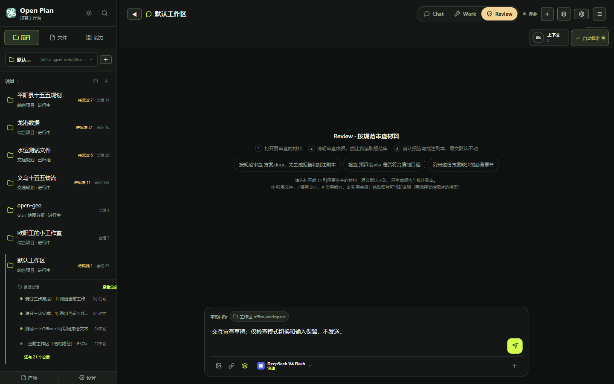

### 02：顶部新建后，页面没有失败提示

界面为空不能证明后端新建成功，需结合失败日志。

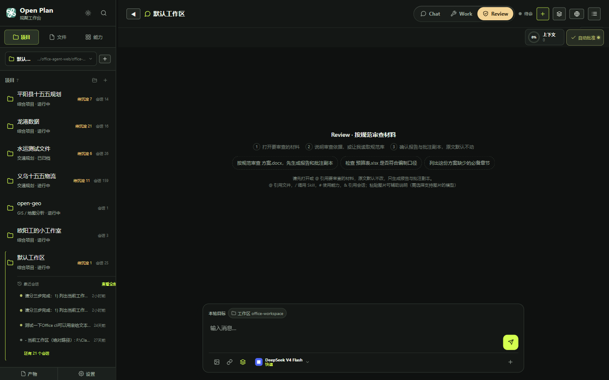

### 03：Escape和外部模式点击后，模型菜单仍开着

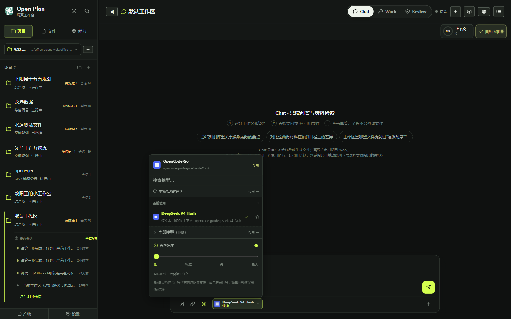

### 04：默认工作区标识与龙港文件列表错位

截图需结合返回workspace的JSON证据判断来源。

### 05：同thread设置返回后，草稿为空

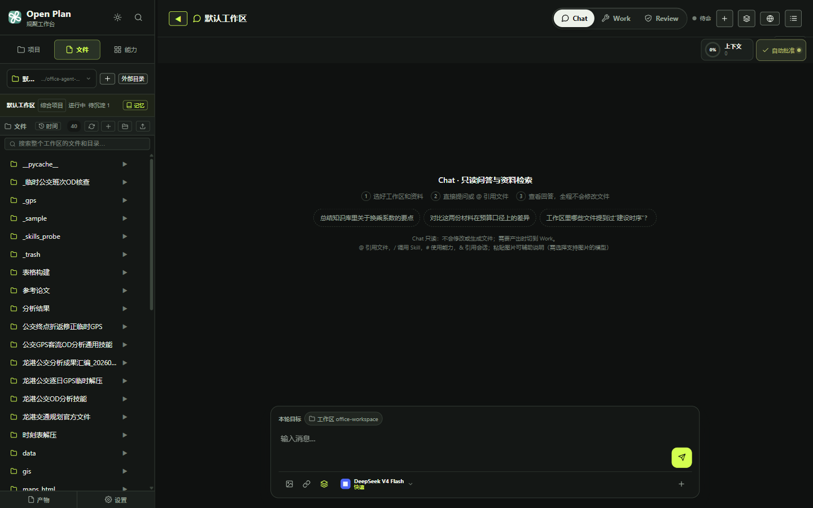

### 06：读取503时，成果页面显示暂无产物

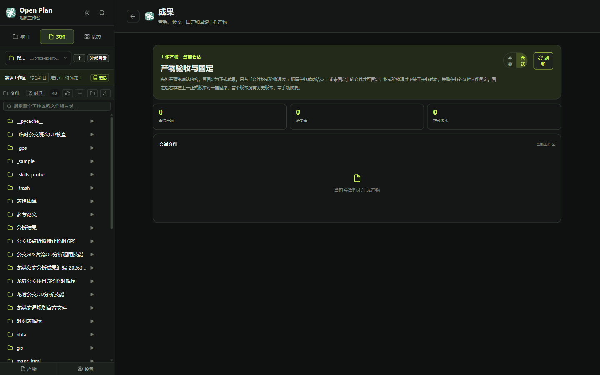

### 07：任务中心筛选正常

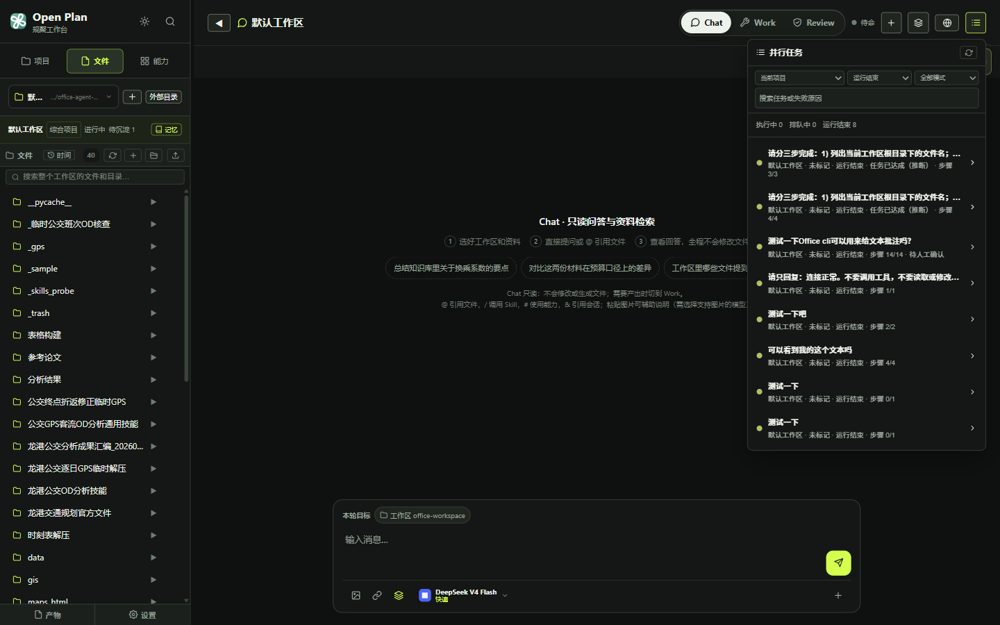

### 08：刷新后仍在旧子目录

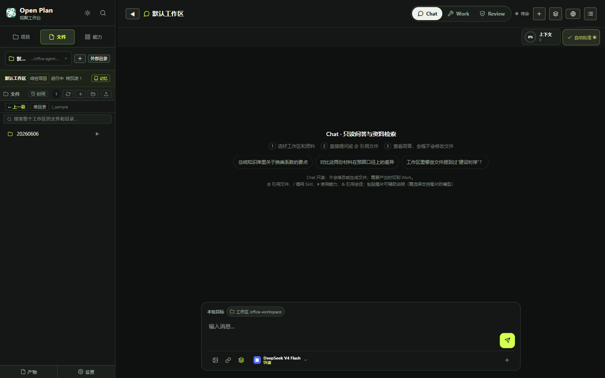

### 09：新建后面包屑归根，旧列表仍在

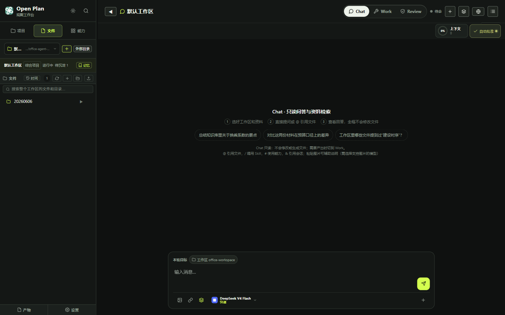

## 14. 交互补充的边界与结束状态

- 本次是定位与交接，界面和业务代码未修改；没有执行模型任务，也没有固定/回滚/删除业务成果。
- 顶部新建失败与侧栏新建成功都做了实测，后者创建了一次空白测试会话，未发送内容。
- 模拟503仅用于本测试浏览器，所有路由已移除；真实接口已恢复。测试浏览器最终为1440×900暗色、Chat、项目侧栏、预览关闭，草稿为空，目录回根。
- 工作区切换失败回滚、跨项目历史、非空会话自动恢复、服务重启与逆序响应暂未实测；文档按源码风险标注，不能当成已完成回归。
- [检查结束状态](交互审查截图/交互检查结束状态.json)记录保存的cwd、根目录和实际加载的JS资源。该文件捕获于刷新启动阶段；不据此宣称有效历史已被自动恢复。
- 第一轮图标截图8张，本次交互追加9张；接手后逐项补修复截图与测试结果，不能只运行构建后就宣布交互正常。
