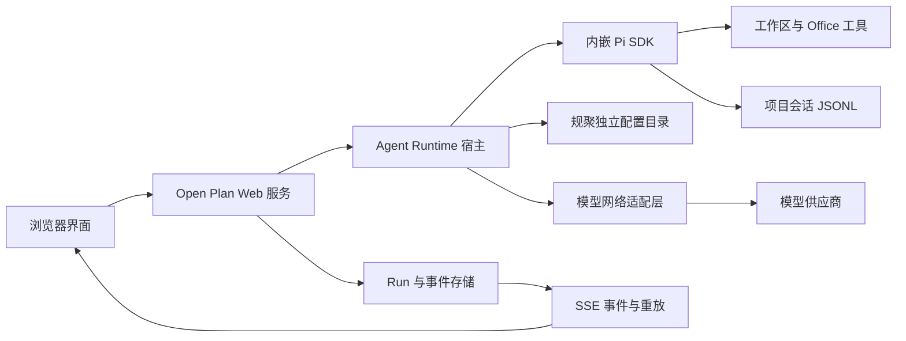

# 修复 Pi 运行时独立化与模型连接稳定性修改计划

## 当前执行状态（2026-09-09）

| 阶段 | 状态 | 验证结果 |
|---|---|---|
| 阶段零：基线冻结 | 已完成 | 修改前后 `npm.cmd run verify` 均通过，用户地图文件未触碰 |
| 阶段一：模型网络适配层 | 已实现并通过本轮验证 | 专用测试、完整 verify 通过；普通宿主中 `opencode-go/mimo-v2.5` 与 `minimax-cn/MiniMax-M2.7-highspeed` 真实请求成功；受限宿主错误归类正确 |
| 阶段二：规聚配置独立化 | 已实现并通过本轮验证 | 独立目录、脱敏预览、显式导入、代理接口、重启持久化、浏览器交互与独立配置真实模型调用均已通过 |
| 阶段三：重试与终态收敛 | 待执行 | 尚未统一应用层与 Pi 重试所有权 |
| 阶段四：SSE 重放 | 待执行 | 尚未增加 Last-Event-ID 与断线补发 |
| 阶段五：Runtime 进程隔离 | 待执行 | 尚未拆分子进程 |
| 阶段六：上下文治理 | 待执行 | 尚未增加预算和滚动摘要 |
| 阶段七：设置页与发布收口 | 部分完成并通过本轮验证 | 已补齐设置页四层脱敏诊断、当前会话 Runtime 关联、连接失败引导和版本记录；阶段三至六完成后再做最终发布验收 |

阶段一当前只证明“新的网络适配路径可用”，不代表整个 3002 服务的前端状态、长对话和 SSE 已全部修复；这些仍按后续阶段验收。

阶段二完成了配置与本地 Pi 的实时解耦。默认只导入模型、运行设置和凭据；历史会话必须额外勾选，避免把大量旧会话自动挤入当前项目。SSE 重放、重试终态和 Runtime 子进程隔离仍属于后续阶段。

本轮阶段七已完成设置页诊断闭环：主设置页会带上当前 `clientId/threadId`，可刷新脱敏诊断并查看 SDK、模型目录、凭据、真实调用、Runtime 和最近失败信息；由于阶段三至六仍未完成，本计划整体状态仍保持 active。

最后验收实测：3002 服务的模型探测接口在当前规聚独立配置没有供应商凭据时，33ms 内返回 `PI_SETTLED_ERROR / network / retryable=true`，没有无限停留在“连接模型”。这证明失败可以快速收敛，但不等于当前环境已具备真实模型调用条件；完成凭据配置后仍需重新执行真实连接验收。

## 一、目标与成功标准

本轮不是更换 Pi，也不是继续堆叠重试，而是让 Open Plan 的模型连接具备可诊断、可恢复、可独立部署的完整边界。

最终必须同时满足：

1. Open Plan 内嵌的 Pi SDK 可以在没有安装 Pi CLI 的电脑上运行。
2. Open Plan 使用自己的模型目录、凭据、网络代理设置和会话目录；本地 Pi 只作为一次性导入来源，不再是实时依赖。
3. “Pi 已加载”“模型已配置”“供应商可访问”“真实模型调用成功”四种状态分开展示。
4. 网络失败、鉴权失败、限流、超时和上下文超限能够被准确分类，前端不再永久停留在“模型已接收信息”或“连接模型”。
5. SSE 断开后可以恢复事件；同一个 Run 不重复消息、不重复执行工具，并且一定产生终态。
6. 正常宿主环境下连续 10 次最小真实请求至少成功 9 次；失败的一次必须在 30 秒内明确结束并允许重试。
7. 20 轮连续对话加 2 次文件读取后，Agent 不进入永久 busy，不需要刷新整个页面才能继续。
8. API、日志、SSE 和诊断界面不得返回明文 API Key。

## 二、当前事实与根因边界

### 2.1 已确认事实

- 项目已经内嵌 `@earendil-works/pi-coding-agent@0.85.1`，版本不低于当前本地 Proma 使用的 Pi 版本；本次问题不是“Pi 太旧”。
- 同一套 Pi SDK、模型配置和 MiniMax 模型在普通宿主网络中能返回真实结果。
- 当前 3002 服务由 Codex 的受限命令运行器启动时，Node 子进程会继承受限网络；MiniMax、DeepSeek 等请求在进入供应商前就出现 `network / fetch failed`。
- SSE 是症状放大器，不是本次 `fetch failed` 的最初根因。后端无首事件或错误没有可靠终态时，前端才会长时间显示“已接收”。
- 当前 `server/workspace.mjs` 默认直接读取用户目录下的 `.pi/agent`；`server/agent.mjs` 还会扫描全局 Pi 会话目录。这属于“内嵌 SDK、但配置和会话没有完全独立”。
- 当前 Pi 内部短重试与应用层备用模型逻辑并存；如果多层同时增加重试，会扩大等待时间，并可能在工具已执行后重复请求。

### 2.2 不能用代码伪装解决的问题

- 启动脚本不能让子进程逃离父进程的网络沙箱。服务如果从受限宿主启动，只能明确报告“宿主网络受限”，不能把它伪装成 Provider 故障。
- 备用模型走的是同一条受限网络时，切换 Provider 无法修复问题。
- 仅把重试次数从 1 增加到 3，不会修复 `fetch failed`，只会让用户等待更久。

### 2.3 设计参考边界

可以参考 Proma 的三点：

- 应用拥有自己的配置和会话目录；
- Pi 调用经过应用自己的网络代理层；
- Agent Runtime 可以独立进程运行和重启。

不直接照搬 Proma 的 Electron 主进程、自动更新、桌面安全存储和产品 UI。本项目当前仍是 Web 工作台，先完成服务端边界和可验证能力。

## 三、目标架构



### 3.1 数据目录

默认目录使用 `%APPDATA%/规聚`，并允许 `OAW_DATA_DIR` 显式覆盖：

```text
%APPDATA%/规聚/
├─ 模型配置.json
├─ 模型目录缓存.json
├─ 凭据.json
├─ 网络代理.json
├─ 运行状态.json
└─ 会话迁移记录.json
```

项目会话继续保存在项目自己的 `.规聚会话`，不搬回全局目录。

### 3.2 兼容规则

- 第一次进入设置页时检测本地 `.pi/agent`，只显示“可导入”，不静默复制凭据。
- 用户确认导入后，复制模型配置和凭据到规聚目录，并写入迁移记录。
- 导入完成后读取规聚目录；修改本地 Pi 默认模型不应改变 Open Plan 当前模型。
- 环境变量 `PI_AGENT_DIR` 只作为兼容或测试覆盖，不再作为默认数据源。

## 四、阶段与精确修改项

## 阶段零：基线冻结与保护

目标：保证后续每一批改动都能判断是修复还是回归。

修改内容：

- 记录当前分支、提交号、Node 版本、Pi 包版本和 3002 端口进程链。
- 保存四类基线：普通宿主直连、受限宿主直连、错误 API Key、不可达地址。
- 不修改下列用户工作区文件：
  - `office-workspace/maps/zhejiang-map/map.config.json`
  - `office-workspace/maps/zhejiang-map/style.json`
  - `office-workspace/maps/zhejiang-map/layers/drawn-mtsdr02w.geojson`
- 不重置或覆盖当前未提交的 0.10.0 前端与服务端修改。

验证：

- `git status --short` 前后对照；
- `npm.cmd run verify` 记录现有结果；
- 保存当前 `/api/status`、模型探测接口和一次 Agent SSE 的输出。

## 阶段一：模型网络适配层与错误分类（0.10.1，P0）

目标：先解决 `network / fetch failed` 无法区分、无法配置代理、无法快速终止的问题。

### 新增文件

- `server/Pi网络代理.mjs`
  - 支持 `direct`、`system`、`manual` 三种模式；
  - 读取 `HTTP_PROXY`、`HTTPS_PROXY`、`NO_PROXY`；
  - 手动代理支持 `OAW_MODEL_PROXY_URL`；
  - 本地地址 `127.0.0.1`、`localhost` 默认绕过代理；
  - 使用与当前 Pi 依赖兼容的 Undici `fetch` 和 `EnvHttpProxyAgent`；
  - 一个配置只维护一个 dispatcher，服务退出时关闭；
  - 导出错误分类函数，把底层错误转换为稳定错误码。

- `scripts/Pi连接稳定性测试.mjs`
  - 测试直连、环境代理、手动代理、`NO_PROXY`；
  - 测试 DNS/连接失败、401、429、超时分类；
  - 测试日志与返回体不包含凭据。

### 修改文件

- `server/Pi运行时管理.mjs`
  - 创建会话时注入代理感知的 `streamFunction` 或 Pi 支持的自定义 `fetch`；
  - 所有真实调用统一经过网络适配层；
  - 运行记录加入 `networkMode`、`errorCategory`、`firstEventLatencyMs`；
  - 运行时销毁时关闭 dispatcher；
  - 不在此阶段修改工具权限和会话格式。

- `package.json` 与锁文件
  - 显式加入与 Pi 兼容的 `undici` 版本；
  - 增加 `test:pi-connectivity` 命令。

实现约束：

- 禁止通过修改 `globalThis.fetch` 影响地图、Office 或其他接口。
- 禁止在请求已经产生模型事件或工具事件后自动重放整轮请求。
- 禁止把代理 URL 中的用户名、密码写入运行日志。

验收：

- 单元测试覆盖上述错误分类；
- 普通宿主真实 MiniMax 最小请求成功；
- 受限宿主在 5 秒内返回 `HOST_NETWORK_RESTRICTED` 或 `NETWORK_UNREACHABLE`，前端不无限等待；
- 错误 Key 返回 `AUTH_ERROR`，不错误显示为网络失败。

## 阶段二：规聚配置独立化与显式导入（0.10.1，P0）

目标：即使电脑没有安装 Pi CLI，也能在 Open Plan 设置好模型后使用 Agent。

### 新增文件

- `server/Pi配置管理.mjs`
  - 解析并创建规聚数据目录；
  - 提供模型、凭据、代理设置的原子读写；
  - 提供本地 Pi 配置“检测、预览、导入”三步接口；
  - 导入采用复制快照，不建立软链接，不持续监听 `.pi`；
  - 对外只返回凭据是否存在和掩码，不返回明文。

### 修改文件

- `server/workspace.mjs`
  - `AGENT_DIR` 默认改为规聚数据目录；
  - 新增 `LOCAL_PI_AGENT_DIR`，只供导入检测使用；
  - 删除 Windows 用户名硬编码；
  - 保留 `PI_AGENT_DIR` 测试覆盖能力。

- `server/Pi运行时管理.mjs`
  - `ModelRuntime.create()` 的 `authPath`、`modelsPath`、`modelsStorePath` 改为规聚配置路径；
  - 凭据修改后只重建模型运行时，不中断已有历史读取；
  - 暴露配置来源：`open-plan`、`environment-override`、`not-configured`。

- `server/agent.mjs`
  - 模型目录和默认模型只读取规聚配置；
  - 移除常态扫描 `.pi/agent/sessions` 的行为；
  - 旧会话迁移改为显式操作，并严格验证目标是 `.jsonl` 文件，不能把目录传给 `SessionManager.open()`。

- `server/index.mjs`
  - 新增：
    - `GET /api/agent/config-status`
    - `GET /api/agent/import-preview`
    - `POST /api/agent/import-config`
    - `GET /api/agent/network-settings`
    - `PATCH /api/agent/network-settings`
  - 所有接口统一脱敏。

- `client/src/api.js`
  - 增加配置状态、导入预览、导入和网络设置 API。

- `client/src/components/SettingsPanel.jsx`
  - “模型与连接”显示配置来源；
  - 提供“从本地 Pi 导入”按钮和确认说明；
  - 加入直连/系统代理/手动代理选择；
  - 把连接状态拆成运行时、凭据、网络、真实调用四项。

验收：

- 将测试环境中的 `.pi/agent` 指向空目录后，Open Plan 仍能用自身配置完成真实模型调用；
- 本地 Pi 改模型后，Open Plan 模型不跟随变化；
- 未经用户点击导入，不生成凭据副本；
- 导入后重启服务，模型目录和凭据状态保持；
- 目录、缺失文件和有效 JSONL 三种会话恢复用例均通过。

## 阶段三：重试、备用模型和终态收敛（0.10.2，P0）

目标：缩短“无回复”的等待，并杜绝重复工具执行。

### 修改文件

- `server/Pi运行时管理.mjs`
  - Pi 原生重试作为唯一的同模型重试所有者；
  - 建议参数：最多 2 次，基础延迟 800ms，只针对可重试的网络/供应商错误；
  - 鉴权、参数、上下文超限不重试；
  - 记录每次尝试和最终原因。

- `server/agent.mjs`
  - 应用层不再对同一模型重复整轮 prompt；
  - 只有在“尚未收到任何模型事件、尚未调用工具”时，才允许一次备用模型切换；
  - 备用模型必须先通过最近健康检查；
  - 20 秒首事件看门狗细分为连接中、排队中、首事件超时；
  - 每次失败都释放 busy/limiter 状态。

- `server/index.mjs`
  - SSE 错误事件携带稳定错误码、是否可重试和用户可执行建议；
  - 无论成功、失败、取消、超时，都发送唯一 `run_finished`。

- `client/src/components/ChatPanel.jsx`
  - 删除无限期“模型已接收信息”占位；
  - 显示“正在连接 / 已连接等待首字 / 正在生成 / 正在调用工具 / 正在重试”真实阶段；
  - 失败卡片提供“重试本轮”和“打开模型设置”；
  - 重试沿用同一个 thread，但新建 runId，不重复插入用户消息。

验收：

- 断网、401、429、首事件超时都在规定时间内产生终态；
- 工具执行后模拟断流，自动重连不得再次执行同一工具；
- 任意失败后下一条消息可以立即发送，不出现永久 busy；
- 连续 10 次真实最小请求成功率达到 90% 以上。

## 阶段四：SSE 事件协议和前端恢复（0.10.2，P1）

目标：后端在运行时，前端即使切会话或短暂断连也能恢复完整对话流和事件流。

### 统一事件结构

```json
{
  "id": "单调事件序号",
  "type": "事件类型",
  "runId": "运行标识",
  "threadId": "会话标识",
  "timestamp": "ISO 时间",
  "data": {}
}
```

### 修改文件

- `server/index.mjs`
  - SSE 支持 `Last-Event-ID`；
  - 每 15 秒发送 heartbeat；
  - 重连时从 Run 事件存储补发，不重新触发 Agent；
  - 终态事件持久化后再关闭连接。

- `server/持久化工具.mjs`
  - 增加安全追加和事件序号校验；
  - 损坏尾行只隔离尾行，不破坏完整历史。

- `client/src/api.js`
  - SSE 客户端保存最后事件 ID；
  - 指数退避重连，但最多一个活动连接。

- `client/src/components/ChatPanel.jsx`
  - 按 `runId + eventId` 去重；
  - 文本 delta 使用批量帧刷新形成打字机效果；
  - 工具、Todo、Ask User、思考和错误事件默认折叠但不丢失；
  - 切换会话仅解除 UI 订阅，不取消后台 Run。

验收：

- 人为断开浏览器网络 5 秒后恢复，消息连续且无重复；
- 切换到另一个会话再切回，后台任务仍在，事件能补齐；
- 所有工具和 Todo 事件在事件流中可查看；
- 同一 run 只有一个终态。

## 阶段五：Agent Runtime 进程隔离（0.10.3，P1）

目标：Pi 或 Provider 调用异常时不拖死 Web 服务，服务重启后能恢复未完成状态。

### 新增文件

- `server/Pi运行时宿主.mjs`
  - 使用 `child_process.fork()` 运行 Pi 会话；
  - 接收创建、发送、取消、压缩、销毁命令；
  - 上报事件、心跳、资源占用和错误。

- `server/Pi运行时协议.mjs`
  - 定义带版本号的进程消息协议；
  - 每条命令包含 `requestId`、`threadId`、`runId`；
  - 未知消息拒绝执行并记录。

### 修改文件

- `server/Pi运行时管理.mjs`
  - 从直接创建 AgentSession 改为管理 Runtime 子进程；
  - 子进程异常退出自动重启，采用 1s/3s/10s 退避；
  - 连续快速崩溃进入 degraded，停止无限重启；
  - Web 服务退出时有序关闭 Runtime。

- `启动规聚服务.ps1`
  - 启动后检查 Web 健康和 Runtime 健康；
  - 明确提示当前父进程是否可能处于受限网络；
  - 监督 Web 服务，但不隐藏连续崩溃原因。

验收：

- 强制终止 Runtime 子进程，Web 页面和历史读取仍可用；
- Runtime 自动重启后可以开始新 Run；
- 不重复恢复已经执行过工具的旧 Run；
- 连续崩溃不会形成高 CPU 的快速重启循环。

## 阶段六：长对话与上下文治理（0.10.3，P1）

目标：长会话不把全部历史、完整文件和全部工具结果重复发送给模型。

### 修改文件

- `server/agent.mjs`
  - 上下文预算拆成系统指令、最近消息、会话摘要、文件引用、工具结果五部分；
  - 文件引用默认发送索引和命中片段，不重复发送整篇；
  - 工具大结果保存为工作产物，模型只保留摘要和路径；
  - 达到 70% 上下文窗口时后台生成滚动摘要；
  - 达到 85% 时先压缩再发送，并产生可见事件；
  - 当前轮用户消息、未完成 Todo、关键约束和引用来源禁止被摘要丢失。

- `client/src/components/ChatPanel.jsx`
  - 展示本轮上下文用量、是否发生压缩和压缩后的保留内容；
  - 用户可查看摘要，不在主对话中显示长 TaskEnvelope。

验收：

- 20 轮对话与 2 个中型文件读取完成；
- 后续请求体不随历史全文线性无限增长；
- 摘要后仍能回答最近任务目标、文件来源和未完成 Todo；
- 前端滚动和输入保持可用。

## 阶段七：设置页、诊断页与发布收口（0.10.3，P1）

目标：普通用户能自己判断“哪里坏了”，并完成独立配置。

### 修改文件

- `client/src/components/SettingsPanel.jsx`
  - 模型图标、模型选择、思考深度保持现有 0.10.0 设计；
  - 增加配置来源、代理方式和四层连接检查；
  - 错误提示使用中文说明和可执行操作；
  - 真实连接测试与 Agent 使用完全相同的 Runtime、代理和凭据路径。

- `client/src/styles.css`
  - 只补充状态、诊断和代理表单样式；
  - 不重做地图、项目树和三栏布局。

- `变更日志.md`
  - 按 0.10.1、0.10.2、0.10.3 记录可验证变更；
  - 不把尚未通过真实模型测试的项目写成“已修复”。

验收：

- 新电脑没有 Pi CLI 时可从设置页完成模型配置和真实调用；
- 用户能区分“SDK 已加载”和“模型可用”；
- 浏览器自动化覆盖模型设置、发送、取消、切换会话、恢复 SSE；
- `npm.cmd run verify`、阶段测试和真实连接测试全部通过后再提交版本。

## 五、统一错误码

| 错误码 | 含义 | 是否自动重试 | 用户动作 |
|---|---|---:|---|
| `HOST_NETWORK_RESTRICTED` | 服务继承了受限宿主网络 | 否 | 从普通终端启动或配置可用代理 |
| `NETWORK_UNREACHABLE` | DNS、TCP、TLS 或 fetch 失败 | 最多 2 次 | 检查网络和代理 |
| `AUTH_ERROR` | Key 缺失、无效或无权限 | 否 | 更新供应商凭据 |
| `RATE_LIMIT` | 供应商限流 | 是 | 等待并按 Retry-After 重试 |
| `MODEL_TIMEOUT` | 在限定时间内无首事件 | 最多 1 次 | 重试或切换健康模型 |
| `CONTEXT_LIMIT` | 上下文超过模型窗口 | 否 | 压缩上下文后重新发送 |
| `MODEL_NOT_FOUND` | 模型目录中无该模型 | 否 | 刷新目录或重新选择 |
| `RUNTIME_BUSY` | 同一会话已有互斥操作 | 否 | 等待当前 Run 或取消 |
| `RUNTIME_CRASHED` | Runtime 子进程退出 | 否 | 自动恢复后新建 Run |
| `SSE_INTERRUPTED` | 前端事件连接中断 | 是 | 从最后事件 ID 恢复 |

## 六、提交拆分与模型协作规则

每个提交只完成一个可回滚能力：

1. `fix(runtime): 增加模型网络代理和错误分类`
2. `fix(config): 将 Pi 配置迁移为规聚独立目录`
3. `fix(agent): 收敛重试和备用模型策略`
4. `fix(stream): 增加 SSE 序号与断线重放`
5. `refactor(runtime): 将 Pi Runtime 隔离为子进程`
6. `perf(agent): 增加长对话上下文预算和压缩`
7. `feat(settings): 完成模型网络诊断与导入界面`

交给其他模型时必须附带以下约束：

- 只修改当前阶段列出的文件；发现相邻问题先记录，不顺手重构。
- 不执行 `git reset --hard`、`git checkout --` 或删除用户文件。
- 不修改地图配置和用户工作区产物。
- 不覆盖现有未提交修改；冲突时停止并报告具体文件。
- 新增文件使用中文名称。
- 每次修改后先跑该阶段测试，再跑 `npm.cmd run verify`。
- 未完成真实模型验证时，只能写“已实现”或“静态测试通过”，不能写“模型连接已修复”。

## 七、Luna 第一批执行单

本批只执行阶段一，不同时做配置迁移、SSE 重构和 Runtime 子进程化。

允许修改：

- `server/Pi网络代理.mjs`（新增）
- `server/Pi运行时管理.mjs`
- `scripts/Pi连接稳定性测试.mjs`（新增）
- `package.json`
- `package-lock.json`

禁止修改：

- `server/index.mjs`
- `server/agent.mjs`
- `client/**`
- `office-workspace/**`
- `启动规聚服务.ps1`

Luna 完成条件：

1. 提交清晰的文件差异说明；
2. 新测试全部通过；
3. `npm.cmd run verify` 通过；
4. 不暴露代理凭据；
5. 不全局替换 fetch；
6. 不能测试真实外网时明确写“未验证”，不得宣称完成连接修复。

## 八、主代理验证清单

Luna 返回后，由主代理独立完成：

1. 审查所有 diff，检查越界修改、重复重试和密钥泄露；
2. 运行 `npm.cmd run test:pi-connectivity`；
3. 运行 `npm.cmd run verify`；
4. 在普通宿主网络执行真实 Pi 最小请求；
5. 在受限宿主复测 `fetch failed`，确认错误分类准确；
6. 启动 3002 服务，通过浏览器检查设置页和一次 Agent 对话；
7. 只有全部验收后才提交阶段一；失败则把精确失败项退回 Luna 修正。

## 九、明确不在本轮顺手修改的内容

- 地图底图切换和地图 Agent UI；
- 项目树视觉样式和模型官方图标；
- Office CLI 功能扩展；
- 知识库、模板库、Skills 广场重设计；
- 桌面打包和自动更新。

这些功能继续保留，但不与模型连接稳定性混在同一批提交，避免无法判断回归来源。
